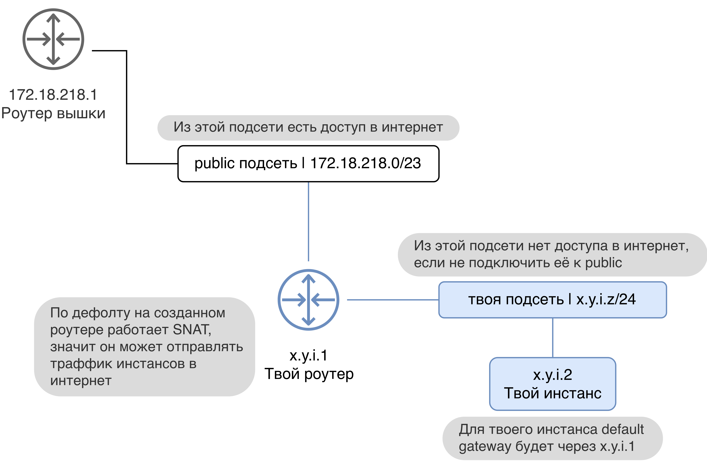

# Quick Start +Lore

> Тут описан процесс ручного создания виртуалки, подключения к VPN и настройки форварда HTTPS на неё с нуля.

Если не понятно: [FAQ](faq.md)


## Создание сервера в [mekstack.ru](https://mekstack.ru)

Авторизация в облаке настроена через auth.hse.ru

В [mekstack.ru/auth/login](https://mekstack.ru/auth/login) вибирай
**Authenticate using Mekstack Vault**

Дальше тебя перекинет на [vault.mekstack.ru](https://vault.mekstack.ru)  
Там по дефолту логин по ``oidc/``: **HSE Identity Provider**, он тебе и нужен

При входе автоматически создадутся проекты, в которых ты состоишь  
Переключаться между ними можно через дропдаун-меню слева сверху  
Если ты не состоишь ни в каких проектах то тебя не пустит в облако с ошибкой 401

> Тыкание кнопок в гуях можно пропустить и сразу раздеплоить инфру терраформом.
> [Реальный темплейт](https://github.com/mmskv/openstack-project-template).


### Создание [Overlay (internal) network](glossary.md#overlay-network)

Без сетей в наше время никуда, создай себе одну.

1. Project -> Networks -> Create Network

2. Дальше нажми на подсеть и придумай для нее любой CIDR. Лучше из приватных, но я тебе не указ.

3. Теперь тыкай на создание сети.  
   Не тыкай на изменение конфигурации DNS серверов, потому что тогда случится много плохих вещей.

4. Созданная подсеть сейчас болтается в воздухе.

   Чтобы из этой подсети можно было ходить в интернет нужно соединить её
   с нашей сетью, которая называется **public**, потому что на ней
   сетевики настроили SNAT. Соединяются сети при помощи роутеров (немного
   L3 лора).

   Создай роутер в Project -> Network -> Routers  
   В ``External Network`` должна стоять **public** сеть.

   

5. Теперь твою подсеть нужно подключить к новому роутеру.

   Network -> Routers -> Тык на свой Router -> Interfaces -> Add Interface -> Выбираешь свою подсеть.  
   Произошла коммутация.


### Настройка Секгрупп

Дальше нужно настроить фаервол, потому что по дефолту он запрещает весь входящий траффик.  
Фаервол в опенстаке называется [Security group](glossary.md#security-group).

Включи ICMP (это ping) и SSH в **default** секгруппе.

1. Project -> Network -> Security Groups -> default -> Manage Rules

2. Add Rule -> All ICMP -> Add

3. Add Rule -> SSH -> Add


### Запуск Инстанса

[Инстанс](glossary.md#instance) это твоя виртуалочка

1. Compute -> Instances -> Launch Instance

2. В Source Выбери имадж (это как iso, но без ручной установки)

3. Там же выбери прикреплять ли дополнительный СХДшный диск к виртуалке кнопкой Create New Volume.  
   Если не создавать, то будет только локальный диск 10-20 гигов с гипера, но он быстрее.

4. Выбери [Flavour](glossary.md#flavor)

5. В Networks выбери свою новую сеть

6. Security Groups пусть остаются на **default**

7. В Key Pair добавь свой публичный SSH ключ

8. Всё, запускай инстанс

Инстанс сейчас в твоей приватной сетке, чтобы до него достучаться нужно прицепить к инстансу [Fip](glossary.md#fip).  
Floating IP выделяются из 172.18.218.0/23, к этой сетке есть доступ из под впн.

1. Project -> Network -> Floating IPs -> Alocate IP To Project

2. Project -> Network -> Floating IPs -> Associate


## [vpnaas.mekstack.ru](https://vpnaas.mekstack.ru)

Сгенерь приватный и публичный ключ, вставь в сайт публичный, а свой конфиг приватный и готово.

``` bash
    wg genkey | tee wg.key | wg pubkey
    sudo wg-quick up ./wg0.conf
    sudo wg-quick down ./wg0.conf
```

На Arch Wiki [написано](https://wiki.archlinux.org/title/WireGuard) про Wireguard поподробнее.


### Проверь впн

``` bash
    ping 172.18.218.2
```

Если работает, то ссшься в свой сервер и делай что хочешь.  
В Ubuntu юзер ``ubuntu``, в Arch юзер ``arch``, в Debian юзер ``debian``.  
Если не работает, то пиши в цулип.


## Публикация сайтиков

Запустил сайтик на виртуалочке и хочешь чтобы люди в интернете тоже молги им полюбоваться?
Настрой форвард траффика на него

1. Сделай A запись для своего домена на публичный адрес мекстака: 194.190.152.81

2. DNS -> Zones -> Create Zone и указываешь там свой домен

3. Тык на зону -> Create Recordset -> В поле Record впиши Floating IP инстанса

4. В [Security group](glossary.md#security-group) инстанса разреши ingress на 80 и 443 порты

5. Теперь все интернет HTTP(S) пакеты, приходящие на 194.190.152.81 с ``Host/SNI
   == {{ твой домен }}`` будут отправляться на твой инстанс

> Если у тебя нет домена, то первый шаг можно попросить сделать кого-нибудь с доменом
> Или купи свой, они по сто рублей на год стоят


Для TLS юзай [сертбота](https://certbot.eff.org/lets-encrypt/)

Как это работает? Да [вот так](https://github.com/mekstack/mekstack/blob/master/infra/sneedaas/user-data.yaml).

На картинке понятней.


## Продолжение

Все еще недостаточно мекстак лора?

В [Cloud native](cloud-native.md) написано про использование Terraform, Ansible, API, openstack-cli.
