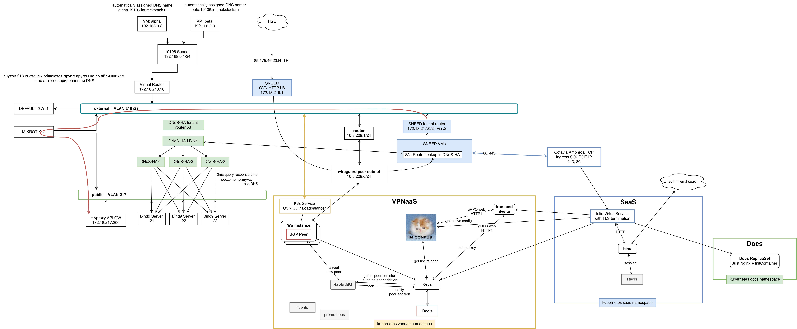

Admin Guides
============

В этой секции находится информация для администраторов облака.

* `<https://github.com/mekstack/mekstack>`_

  Репозиторий с конфигурацией Kolla, Kayobe и IaC инфраструктуры.

Архитектура
-----------

TODO описание архитектуры

Bootstrapping kayobe host
-------------------------

.. note::

    Почему отдельный сервер для kayobe?

    Тогда не произойдет ситуации, когда два разных человека с двумя разными
    конфигурациями одновременно деплоят одно облако.

Enroll bifrost inventory
************************

.. code-block:: bash

    export OS_CLOUD=bifrost
    export BIFROST_INVENTORY_SOURCE=/etc/bifrost/servers.yml
    cd playbooks
    ansible-playbook -vvvv -i inventory/bifrost_inventory.py enroll-dynamic.yaml

Post deploy
-----------

Что надо делать после первого деплоя

Configure db for mappings to fit
********************************

Для костылей интеграции с cabinet.miem.hse.ru нужно увеличить размер колонки
с маппингами, потому что они не помещаются в стандартный.

.. code-block::

    docker exec -it mariadb bash
    mysql -u keystone -p

    use keystone;
    alter table mapping change rules rules longtext;
